

    <figure>
        
    </figure>

 

&nbsp;&nbsp;&nbsp;&nbsp;GAN(Generative Adversarial Networks)은 2014년에 발표된 이후 지금까지 많은 연구를 통해 눈부신 발전을 이루었습니다. 특히 무작위로 생성된 latent code로부터 가상의 이미지를 합성해내는 생성 모델 분야에 큰 영향을 끼쳤는데, 2020년 현재에 이르러서는 BigGAN이나 PGGAN, StyleGAN과 같은 모델을 통해 만들어진 고해상도의 이미지들은 심지어 사람의 눈으로도 가짜라는 걸 분간할 수 없을 만큼 고도화가 이루어졌습니다. 위의 사진은 BigGAN을 통해 생성된 $$512 \times 512$$ 크기의 이미지들인데, 이를 첫눈에 실제가 아니라고 분간할 수 있는 사람은 많지 않을 것입니다.

    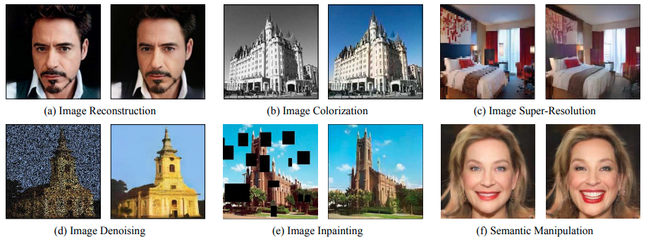

 

&nbsp;&nbsp;&nbsp;&nbsp;GAN은 이와 같은 강력한 이미지 생성 능력을 기반으로 SISR(Single Image Super-Resolution), denoising, inpainting와 같은 여러 이미지 처리 분야에도 널리 쓰이고 있습니다. 하지만 대부분의 GAN을 이용한 이미지 처리 모델들은 해당 task에만 특화된 loss function과 네트워크 구조를 이용한다는 한계점이 있습니다. 물론 많은 task에 활용될 수 있는 pix2pix나 CycleGAN과 같은 image-to-image translation 모델들이 있긴 하지만, 이러한 모델들 역시 adversarial learning의 개념만 추가한 지도 학습을 진행한다는 한계가 있습니다. 다시 말해 GAN의 향만 첨가한 정도라는 것입니다. 그래서 image-to-image translation 모델들이 만드는 결과는 생성 모델이 만들어 내는 가상의 이미지만큼 높은 퀄리티를 가지지 못한다는 단점이 있었습니다.

&nbsp;&nbsp;&nbsp;&nbsp;이러한 한계점을 극복하고자 최근에는 미리 학습된 BigGAN이나 StyleGAN과 같은 생성 모델을 이용해 GAN의 강력한 이미지 생성 능력을 활용함과 동시에 별도의 학습 또한 필요로 하지 않는 장점을 취하는 방법론을 주로 채용하는 추세입니다. [이전 포스트](https://dy120.github.io/PULSE)에서 살펴본 PULSE라는 모델 또한 이러한 아이디어를 채용하여 개발된 모델이라고 볼 수 있습니다. 

    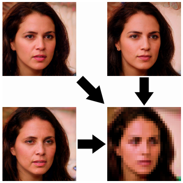

 

&nbsp;&nbsp;&nbsp;&nbsp;원리를 간단하게 짚고 넘어가자면, 원하는 이미지 처리 결과를 미리 학습된 생성 모델이 만들어 낼 수 있는 이미지의 범위, 즉 latent space 내에서 직접 찾아낸다는 것입니다. 예를 들어서 PULSE는 생성 모델이 만들어낼 수 있는 수없이 많은 얼굴 이미지들 중에서 downscaling을 해서 기존의 입력 이미지가 될 수 있는 이미지들을 찾아내는 방식으로 face hallucination(얼굴에 대한 SISR)을 수행합니다. 이 때 해당 이미지들을 찾는 건 입력 이미지와 동일한 해상도로 downscaling을 했을 때 입력 이미지와의 distance를 loss function으로 두고 이를 최소화하는 방향으로 back-propagation을 통해 latent vector를 최적화시키는 방식으로 진행됩니다.

<!---
 PULSE는 입력된 저화질 이미지 $$I_{LR}$$과 downscaling 된 고화질 이미지 $$DS(G(z))$$ 사이의 pixel-wise loss $$\lVert DS(G(z)) - I_{LR} \rVert_p^p$$를 최소화시키는 latent code $$z$$를 back-propagation을 통해 얻어내 SISR을 수행하는 모델이었습니다. 
--->

&nbsp;&nbsp;&nbsp;&nbsp;PULSE는 이와 같은 원리로 꽤 괜찮은 결과를 냈지만, 실제로는 back-propagation을 통해 그 정도로 좋은 결과를 내기는 쉽지 않습니다. PULSE는 latent code를 초기화할 때 Gaussian prior를 걺으로써 latent space를 구의 평면으로 재정의하여 탐색을 진행한다는 새로운 아이디어를 통해 성능 향상을 이룰 수 있었지만, 이와 같은 특정 기술 없이 back-propagation만 사용한 기존의 모델들은 좋은 성능을 내지 못했습니다.

&nbsp;&nbsp;&nbsp;&nbsp;이번 포스트에서 소개해드릴 논문은 이와 같은 문제점이 단일 latent code만을 최적화의 대상으로 삼는 것에서 비롯됐다고 주장하며 새로운 접근법인 mGANprior를 제시했습니다. CVPR'20에서 소개된 논문인 [**Image Processing Using Multi-Code GAN Prior**](https://openaccess.thecvf.com/content_CVPR_2020/html/Gu_Image_Processing_Using_Multi-Code_GAN_Prior_CVPR_2020_paper.html)를 살펴보면서 이를 활용해 GAN을 이용한 효과적인 이미지 처리가 어떻게 이루어지는지 알아보도록 하겠습니다.

# Introduction

    

 

&nbsp;&nbsp;&nbsp;&nbsp;우선 미리 학습된 생성 모델을 통해 이미지 처리 모델을 구현하려면 한 가지 추가적인 핵심적인 기술을 필요로 합니다. 바로 GAN inversion이라 불리는 기술입니다. 기존의 생성 모델에서 generator $$G$$가 무작위로 생성된 latent code $$z$$를 입력으로 받아 가상의 이미지 $$G(z)$$를 생성해 출력했다면, GAN inversion은 실제 이미지 $$x$$와 특정 reconstruction loss $$\mathcal{L}(\cdot)$$에 대해 다음 조건을 만족하는 latent code $$z^*$$를 출력하는 것을 다룹니다. 

$$z^* = \arg\min_{z \in \mathcal{Z}} \mathcal{L}(G(z), x)$$

만약 $$\mathcal{L}(\cdot)$$을 단순한 pixel-wise loss라고 생각한다면 이 식을 푸는 것은 $$G$$에 입력됐을 때 $$x$$와 최대한 동일한 이미지가 나오는 latent code를 찾는 문제가 됩니다. 이름 그대로 이미지를 입력으로 받아 해당하는 latent code를 출력하는 GAN의 역변환이라고 볼 수 있는 것입니다. 이 과정이 제대로 이루어졌다면 역변환된 latent code를 생성 모델에 입력했을 때 원래의 이미지가 제대로 나와야 할 것입니다.

&nbsp;&nbsp;&nbsp;&nbsp;여기서 reconstruction loss를 다르게 정의함으로써 여러 가지 이미지 처리 문제에 적용시킬 수 있습니다. 예를 들어, 흑백 이미지를 컬러 이미지로 변환하는 image colorization 문제라면 다음과 같이 이미지의 휘도에 해당하는 채널(YCbCr 컬러 공간에서 Y 채널)만을 취해 흑백 이미지를 만드는 전처리 함수 $$\texttt{gray}(\cdot)$$를 써서 loss function을 새로 정의할 수 있습니다.

$$\mathcal{L}_{color} = \mathcal{L}(\texttt{gray}(G(z)), I_{gray})$$

이를 이용한 back-propagation으로 latent code $$z$$를 최적화하는 것은 흑백으로 만들었을 때 입력 흑백 이미지와 동일하게 되는 이미지를 미리 학습된 생성 모델의 latent space에서 찾는 것과 같을 것입니다.

&nbsp;&nbsp;&nbsp;&nbsp;이러한 방식으로 생성 모델을 이미지 처리에 활용하려는 연구가 여럿 있었지만, 앞서 설명했듯 좋은 성과를 내지는 못했습니다. 이 논문의 저자들은 그 이유를 기존 연구들이 단일 latent code만을 최적화하려고 했기 때문이라고 분석했습니다. 더 정확히 말하자면, 단일 latent code만을 다루게 되면 생성 모델의 latent space에 정답이 되는 이미지가 포함이 되지 않을 때 해당 이미지에 대한 완벽한 inversion이 존재하지 않게 되므로 정답을 아예 찾을 수 없기 때문입니다.

&nbsp;&nbsp;&nbsp;&nbsp;이 논문은 여러 개의 latent code를 이용한 새로운 GAN inversion을 제시하면서 다음과 같은 contribution을 주장했습니다.
- 여러 개의 latent code와 adaptive channel importance를 활용한 새로운 GAN inversion 방법인 mGANprior(multi-code GAN prior)를 제시함
- mGANprior를 image colorization, SISR, image inpainting 등 다양한 실제 이미지 처리 문제에 적용시킴
- GAN generator의 각 layer에 있는 feature들을 결합하여 각각 다른 layer에서의 internal representation을 분석하는 방법을 제시함

# Method

    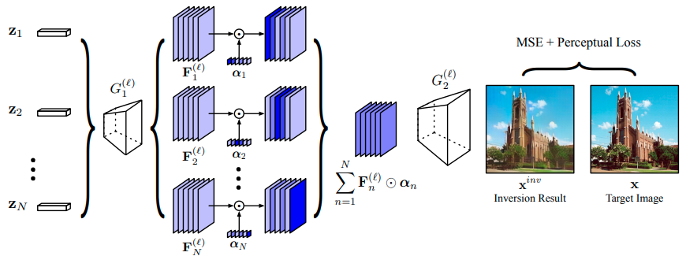

 

&nbsp;&nbsp;&nbsp;&nbsp;mGANprior는 그 이름에 걸맞게 여러 개의 latent code $$\{z_n\}^N_{n=1}$$를 사용합니다. 이 latent code들은 기본적으로 적절한 방식으로 합쳐져서 하나의 이미지를 표현할 수 있어야 합니다. 각각의 latent code들을 어떻게 정의해야 할까요?

&nbsp;&nbsp;&nbsp;&nbsp;단순히 생각하면, 다음과 같이 latent code들의 단순합에 대응되는 이미지는 각각의 latent code들에 대응되는 이미지의 단순합이 되도록 정의할 수 있을 것 같습니다.

$$G\left(\sum_{n=1}^N z_n\right) = \sum_{n=1}^N x_n$$

하지만 실제로는 생성 모델의 latent space는 선형 공간이 아니기 때문에 이와 같은 단순한 정의는 불가능합니다. 따라서 이들을 합치는 다른 방법을 생각해야 합니다.

&nbsp;&nbsp;&nbsp;&nbsp;최근에는 여러 연구를 통해 GAN inversion에서 latent code 자체를 분석하는 것보다 generator의 중간 layer에서 feature를 분석하는 것이 더 효과적이라는 것이 알려졌습니다. 이를 채용하여 저자들은 입력으로 들어오는 latent code가 아니라 generator 네트워크에서의 intermediate feature map들을 합치는 방식을 채용하기로 했습니다. 

&nbsp;&nbsp;&nbsp;&nbsp;먼저 $$G(\cdot)$$을 두 개의 sub-network $$G_1^{(\ell)}(\cdot)$$과 $$G_2^{(\ell)}(\cdot)$$으로 나누어야 합니다. Generator의 $$\ell$$번째까지의 layer들로 이루어진 $$G_1^{(\ell)}(\cdot)$$을 이용해 $$n$$번째 latent code를 입력했을 때 $$\ell$$번째 layer에서 얻을 수 있는 feature map을 다음과 같이 정의할 수 있습니다.

$$F_n^{(\ell)} = G_1^{(\ell)}(z_n)$$

여기에 학습 가능한 parameter $$\alpha_n \in \mathbb{R}^C$$를 이용해 다음과 같은 weighted sum을 구할 수 있을 것입니다.

$$\sum_{n=1}^{N} F_n^{(\ell)} \odot \alpha_n$$

이는 $$F_n^{(\ell)}$$의 각 채널 중 어떤 채널에 더 큰 비중을 둘지를 결정하는 adaptive channel importance를 적용해 각 feature map을 하나로 합치는 것으로 볼 수 있습니다. 이제 합쳐진 feature map을 generator의 나머지 부분인 $$G_2^{(\ell)}$$에 입력함으로써 결과 이미지를 생성할 수 있습니다.

$$x^{inv} = G_2^{(\ell)} \left(\sum_{n=1}^{N} F_n^{(\ell)} \odot \alpha_n\right)$$

&nbsp;&nbsp;&nbsp;&nbsp;이제 우리가 풀어야 할 문제를 다음과 같은 식으로 표현할 수 있습니다.

$$\{ z_n^* \}_{n=1}^N,\{ \alpha_n^* \}_{n=1}^N = \argmin_{\{ z_n \}_{n=1}^N,\{ \alpha_n \}_{n=1}^N} \mathcal{L}(x^{inv}, x)$$

저자들은 reconstruction loss $$\mathcal{L}$$을 다음과 같이 pixel-wise error와 perceptual error의 합으로 정의했습니다.

$$\mathcal{L}(x_1, x_2) = \lVert x_1-x_2 \rVert_2^2 + \lVert \phi(x_1) - \phi(x_2) \rVert_1$$

여기서 $$\phi(\cdot)$$는 미리 학습된 VGG-16에 이미지를 입력한 뒤 4번째 block의 3번째 convolutional layer에서 얻을 수 있는 intermediate feature map을 의미합니다. 이렇게 되면 reconstruction loss는 두 이미지의 low-level에서의 거리와 high-level에서의 거리를 모두 반영하게 됩니다.

&nbsp;&nbsp;&nbsp;&nbsp;이제 이 방법을 실제 이미지 처리 task에 적용해야 합니다. 본 논문에서는 image colorization, SISR, 그리고 image inpainting까지 총 세 가지의 이미지 처리 task를 다루었습니다. 각각의 task는 다음과 같은 reconstruction loss를 최적화함으로써 수행됩니다.

$$\mathcal{L}_{color} = \mathcal{L} \left( \texttt{gray}(x^{inv}), I_{gray} \right)$$

$$\mathcal{L}_{SR} = \mathcal{L} \left( \texttt{down}(x^{inv}), I_{LR} \right)$$

$$\mathcal{L}_{inp} = \mathcal{L} \left( x^{inv} \circ m, I_{ori} \circ m \right)$$

차례대로 $$\texttt{gray}(\cdot)$$은 휘도 채널 추출, $$\texttt{down}(\cdot)$$은 downscaling, 그리고 $$m$$은 가려진 픽셀 위치를 0, 나머지를 1로 채운 binary mask를 의미하고 $$I_{gray}, I_{LR}, I_{ori}$$는 입력 이미지를 가리킵니다.

# Experiments

    

 

&nbsp;&nbsp;&nbsp;&nbsp;본 논문에서는 PGGAN과 StyleGAN을 이용해 mGANprior를 구현하였으며, 얼굴을 위해 CelebA-HQ와 FFHQ 데이터셋이, 교회 및 침실 등의 사진을 위해서 LSUN 데이터셋이 사용되었다고 합니다. 이렇게 구현된 mGANprior는 단일 latent code를 최적화하거나 이미지를 입력으로 받는 별도의 encoder를 학습시키는 방식보다 훨씬 그럴싸하게 실제 이미지를 따라할 수 있었다고 합니다.

    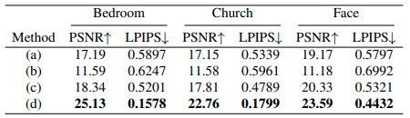

 

&nbsp;&nbsp;&nbsp;&nbsp;또한 수치상으로도 mGANprior가 기존 방식 대비 월등히 높은 PSNR과 낮은 LPIPS를 보여주는 것을 확인할 수 있었습니다. 이는 mGANprior를 통해 얻어낸 결과물이 훨씬 더 원본과 유사하면서 실제 사진인 것처럼 그럴싸해 보인다는 것을 의미합니다. 

    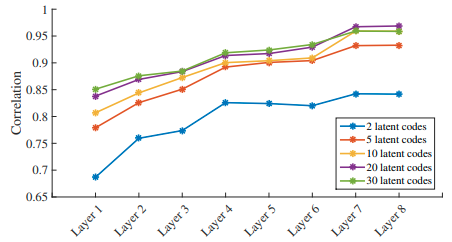

 

&nbsp;&nbsp;&nbsp;&nbsp;저자들은 또한 실험을 통해 mGANprior를 통해 만들어진 latent code를 분석했습니다. 우선 몇 개의 latent code를 사용하는 것이 가장 좋은지를 살펴봤습니다. 막연히 생각해보면 더 많은 latent code를 쓸 수록 계산량은 많아지지만 성능은 좋아질 것이라고 추측할 수 있을 것입니다. 하지만 실제로는 20개 이상의 latent code를 쓸 때부터는 유의미한 성능 향상이 없었다고 합니다.

&nbsp;&nbsp;&nbsp;&nbsp;또한 generator에서 intermediate feature를 합칠 지점을 정하는 것도 중요한 사항입니다. 8개의 layer를 가진 PGGAN으로 실험한 결과, 더 뒤에 있는 layer를 선택할수록 더 좋은 결과가 나온다는 것이 확인되었습니다. 이는 뒷단에 있는 layer일수록 이미지의 패턴이나 테두리, 색과 같은 디테일한 부분들에 대한 정보를 담고 있기 때문에 더 좋은 품질의 결과를 낸다고 해석할 수 있습니다.

    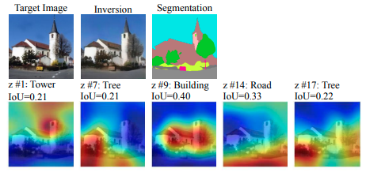

 

&nbsp;&nbsp;&nbsp;&nbsp;마찬가지로 각 latent code가 이미지의 어떤 부분들에 영향을 끼치는지도 중요합니다. 저자들은 먼저 adaptive channel importance $$\alpha_n$$에서 0.2보다 큰 값들을 모두 0으로 설정하여 $$\alpha_n'$$을 구했습니다. 이 때 $$\alpha_n$$과 $$\alpha_n'$$ 각각을 이용해 이미지를 생성하고 그 차이를 계산해 difference map을 구하면 $$n$$번째 latent code에 의한 영향력이 사라지면서 이미지의 어느 부분이 가장 큰 영향을 받았는지를 확인할 수 있을 것입니다. 더 나아가 segmentation map과 해당 difference map를 비교했을 때 가장 IoU(Intersection-over-Union)가 높게 나오는 class를 찾으면 $$n$$번째 latent code가 어떤 class와 가장 깊은 연관이 있는지도 명확하게 찾을 수 있을 것입니다.

    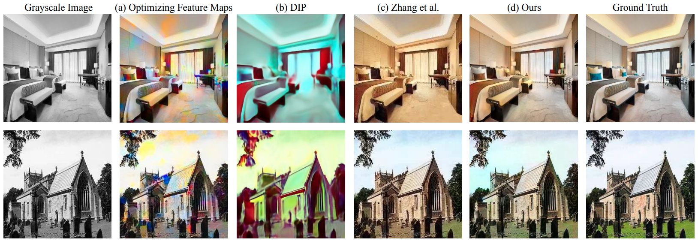
    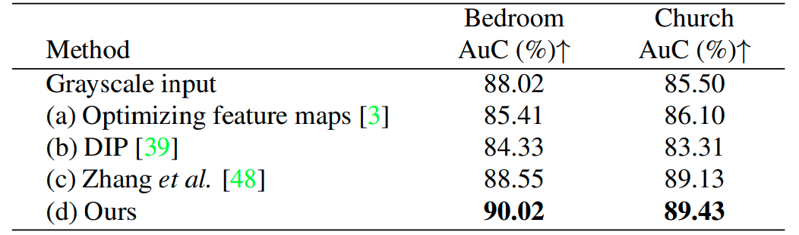

 

&nbsp;&nbsp;&nbsp;&nbsp;이제 본격적으로 mGANprior를 여러 가지 이미지 처리에 적용했을 때 어떤 결과가 나오는지 살펴봅시다. 우선 image colorization에 대한 결과입니다. 기존에 쓰이던 방식들과 비교했을 때 정량적으로나 정성적으로나 mGANprior를 사용하여 색을 입힌 것이 더 좋은 결과를 냈다는 것을 확인할 수 있었습니다. 

&nbsp;&nbsp;&nbsp;&nbsp;특히 image colorization에 특화된 모델인 (c)와 비교하자면, mGANprior는 GAN의 풍부한 표현력 덕분에 하나의 범주에서만 보자면 더 좋은 성능을 보입니다. 그와 동시에 일반적으로 모든 종류의 이미지에 적용할 수 있는 (c)와는 다르게 한정된 범위 내에서만 적용이 가능하다는 한계도 존재합니다. 만약 더 거대한 네트워크와 더 다양한 데이터셋을 쓴다면 이에 대한 generalization ability를 보다 향상시킬 수 있을 것이라고 생각됩니다.

    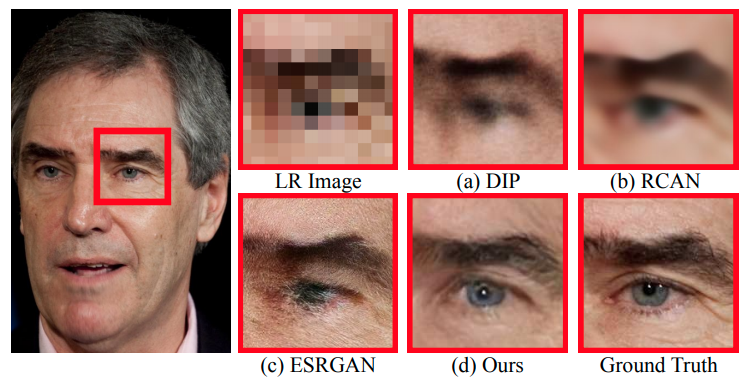
    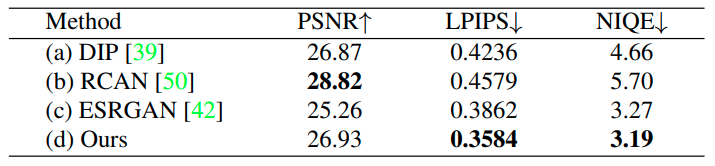

 

&nbsp;&nbsp;&nbsp;&nbsp;SISR에 대해서는 PULSE에서 그랬던 것처럼 사람의 얼굴 이미지에 대해 결과를 비교했습니다. GAN 기반의 방식이다보니 pixel-wise loss 기반의 방식인 RCAN보다 PSNR이 떨어지는 것은 어쩔 수 없다고 하면, 모든 면에서 좋은 결과를 보여줬습니다. 개인적으로는 PULSE와 비교했을 때 어느 쪽이 더 나을지도 궁금합니다.

    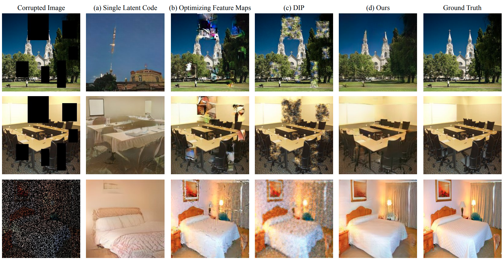
    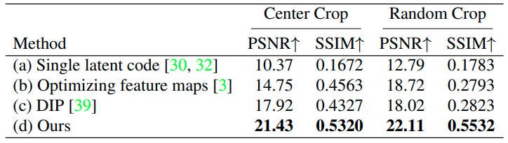

 

&nbsp;&nbsp;&nbsp;&nbsp;마지막으로 image inpainting과 denoising에 대한 결과입니다. 표에서 center crop은 가운데의 $$64 \times 64$$ 영역을, random crop은 전체에서 80%만큼 임의의 pixel을 지웠을 때의 결과를 나타냅니다. 마찬가지로 기존의 방식들을 정량적으로나 정성적으로나 압도하는 결과가 나온 걸 확인할 수 있었습니다.

    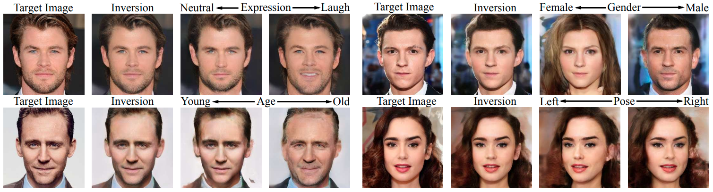

 

&nbsp;&nbsp;&nbsp;&nbsp;지금까지는 이전부터 활발하게 연구되어 온 low-level 이미지 처리 task에 대해 살펴봤습니다. 여기서 저자들은 semantic manipulation와 같은 high-level task에 대해서도 mGANprior가 좋은 성능을 낸다고 주장합니다. 이들은 mGANprior를 통해 입력 이미지로부터 inversion 된 latent code를 얻은 뒤 이를 [InterFaceGAN](https://openaccess.thecvf.com/content_CVPR_2020/papers/Shen_Interpreting_the_Latent_Space_of_GANs_for_Semantic_Face_Editing_CVPR_2020_paper.pdf)을 활용해 조절하여 이미지 속 얼굴의 표정이나 성별, 나이, 포즈를 바꿔보는 실험을 진행했습니다. 비교 대상은 없지만, 마찬가지로 상당히 훌륭한 결과가 나온다는 것은 확인할 수 있었습니다.

    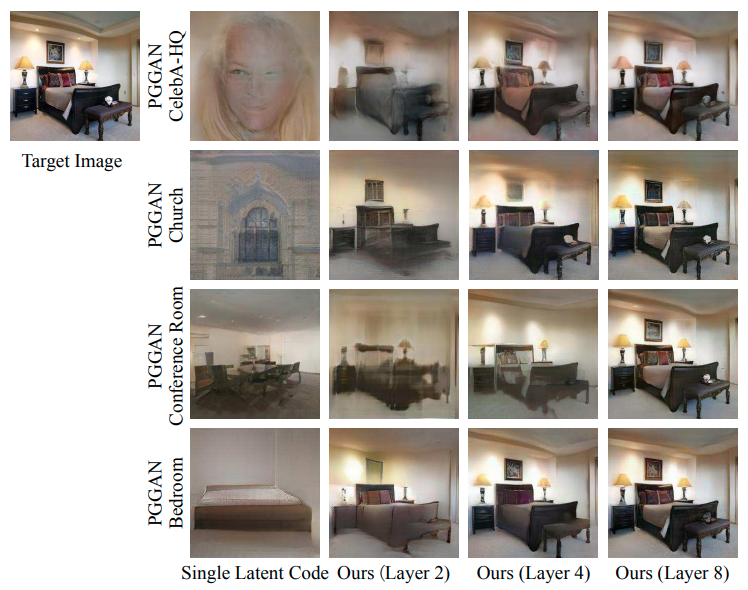

 

&nbsp;&nbsp;&nbsp;&nbsp;여러 실험들을 통해서 GAN 기반의 생성 모델을 활용한 이미지 처리가 효과적인 성능을 보인다는 것을 알게 되었지만, 여전히 명백한 한계는 존재합니다. 바로 생성 모델을 학습시키는 데 썼던 데이터셋의 domain에 포함되지 않는 이미지에 대해서는 제 성능을 발휘할 수 없다는 점입니다. 가령 CelebA-HQ라는 고화질의 얼굴 이미지들로 이루어진 데이터셋으로 학습된 생성 모델이라면 침실 이미지로부터 GAN inversion을 통해 제대로 된 latent code를 뽑아내는 것은 불가능할 것입니다.

&nbsp;&nbsp;&nbsp;&nbsp;그런데 mGANprior를 활용하면 이러한 한계마저 어느 정도 극복할 수 있다고 합니다. 위의 그림은 사람 얼굴, 교회, 회의실, 침실 이미지로만 이루어진 데이터셋으로 학습시킨 각각의 생성모델을 활용하여 침실 이미지를 GAN inversion 시켰을 때의 reconstruction 결과입니다. 우선 단일 latent code를 사용했을 때는 앞서 말했듯이 전혀 다른 이미지를 생성해내는 것을 확인할 수 있었습니다. 심지어 침실로 이루어진 데이터셋으로 학습했을 경우에도 말입니다. 

&nbsp;&nbsp;&nbsp;&nbsp;반면 mGANprior를 사용했을 때는 어떠한 데이터셋으로 학습하였던 꽤나 그럴싸한 결과가 나왔습니다. 거기다가 앞선 실험에서 확인했듯 generator에서 intermediate feature map을 합치는 지점을 뒤쪽 layer로 잡을 수록 더 좋은 결과가 나온다는 것도 확인할 수 있었는데, 마지막 layer를 그 지점으로 잡았을 때는 어떠한 데이터셋에 대해서도 거의 원본과 유사하게 reconstruction이 가능했을 정도입니다. 

    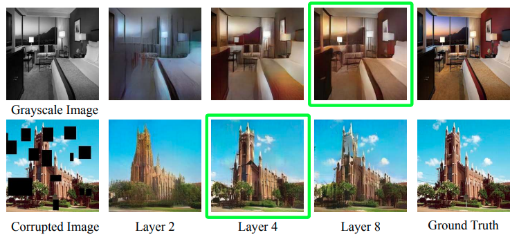

 

&nbsp;&nbsp;&nbsp;&nbsp;한편 colorization과 inpainting에 대해 같은 방식으로 실험을 진행하면 다음과 같은 결과가 나옵니다. Colorization의 경우에는 GAN inversion과 마찬가지로 더 깊은 지점에서 intermediate feature map을 합칠 수록 좋은 결과가 나왔지만, inpainting의 경우에는 중간 지점에서 합치는 게 더 좋은 것을 확인할 수 있습니다. 이에 대해 저자들은 colorization의 경우는 이미지에 포함된 의미론적인 정보보다는 단순한 pixel value에 초점을 두기 때문에 이를 다루기 위해 상대적으로 깊은 layer에서 추출한 feature map을 합치는 것이, inpainting의 경우는 빈 공간을 채우기 위해서 의미론적인 정보가 필요하기 때문에 상대적으로 얕은 layer에서 추출한 feature map을 합치는 것이 좋기 때문이라고 분석했습니다.

# Conclusion