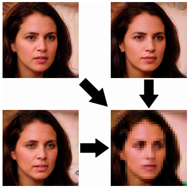

    <figure>
        
        <figcaption></figcaption>
    </figure>

 

&nbsp;&nbsp;&nbsp;&nbsp;Single-Image Super-Resolution(SISR)은 저해상도(Low-Resolution, LR)의 이미지를 입력으로 받아 고해상도(High-Resolution, HR)의 이미지로 복원하는 것을 목표로 하는 기술입니다. 기본적으로 SISR에서 LR 이미지와 HR 이미지 사이의 관계는 일대다 관계입니다. 서로 다른 이미지라도 downscaling을 통해 같은 이미지가 될 수 있기 때문입니다. 이러한 특성 때문에 SISR은 여러 개의 미지수를 포함하는 하나의 방정식을 푸는 것처럼 가능한 답이 여러 개가 나올 수 있는 ill-posed problem으로 분류됩니다.

&nbsp;&nbsp;&nbsp;&nbsp;SISR은 고해상도 이미지를 필요로 하는 곳이라면 어디든 활용될 수 있습니다. 이번 포스트에서는 그 중에서 얼굴에 대한 SISR에 대해 집중적으로 다뤄볼 예정입니다. 이는 Face Hallucination이라는 별도의 이름으로 불릴 정도로 큰 비중을 차지하는 task입니다. 드라마나 영화에서 카메라 속 작은 얼굴을 확대하고 복원해 신원을 확인하는 틀에 박힌 장면이 자주 등장하기 때문에, 어찌 보면 computer vision의 여러 분야들 중에서 사전지식이 전혀 없는 사람들에게도 가장 친숙한 분야 중 하나라고 볼 수 있을 것입니다.

&nbsp;&nbsp;&nbsp;&nbsp;SISR은 2015년에 발표된 SRCNN[1](#footnote_1)의 등장 이후 딥러닝이 적용되기 시작하면서 활발하게 연구되어 왔으며, 주로 LR 이미지로부터 복원된 SR 이미지와 원본 HR 이미지 사이의 pixel-wise average distance(픽셀 단위 평균 거리)를 최소화하는 방향으로 모델을 학습시키는 방식을 사용했습니다. 이를 위해선 ground truth가 되는 HR 이미지와 그에 해당하는 LR 이미지로 이루어진 pair가 반드시 필요하기 때문에 딥러닝 기반의 SISR 모델들은 거의 대부분이 supervised learning(지도 학습) 기반이었습니다.

&nbsp;&nbsp;&nbsp;&nbsp;하지만 이러한 방식은 여러 단점이 존재했습니다. 우선 이 방식은 작은 영역에서 픽셀값이 크게 변해 높은 variance를 보여주는 영역, 예를 들어서 디테일한 질감이나 사물의 모서리와 같은 부분을 복원하는데 있어서 취약하기 때문에 결과가 선명하지도 않을 뿐더러 그만큼 인위적으로 만들어진 티가 강하게 나게 됩니다. 또한 복원된 이미지를 다시 downscaling 했을 때 원래의 LR 이미지와 동떨어진 결과가 나오는 것도 하나의 문제점으로 알려져 있습니다.

&nbsp;&nbsp;&nbsp;&nbsp;이번 포스트에서는 CVPR'20에서 소개된 논문인 [**PULSE: Self-Supervised Photo Upsampling via Latent Space Exploration of Generative Models**](https://openaccess.thecvf.com/content_CVPR_2020/html/Menon_PULSE_Self-Supervised_Photo_Upsampling_via_Latent_Space_Exploration_of_Generative_CVPR_2020_paper.html)에 대해 살펴보면서 이 논문에서 제안하는 새로운 SISR 모델이 기존 supervised learning 기반 모델들의 문제점을 어떻게 해결하였는지에 대해 이야기해보도록 하겠습니다.

# Introduction

 

&nbsp;&nbsp;&nbsp;&nbsp;이 논문의 저자들은 입력으로 받은 LR 이미지를 그에 대응하는 HR 이미지로 출력하는 모델을 학습시키는 기존의 틀을 깨고 새로운 방식으로 SISR 문제를 해결하려 했습니다. 무려 입력 LR 이미지로부터 그에 해당하는 HR 이미지를 모델의 학습 없이 바로 탐색하는 방식입니다. 마치 암호를 해독하기 위해 기존에 알고 있는 암호문-평문 pair들을 사용해 암호 체계를 분석하기보다 정답이 되는 평문 자체를 찾는다는 것과 같이 들립니다. 이게 과연 가능한 방법일까요?

&nbsp;&nbsp;&nbsp;&nbsp;이를 위해서는 우선 realistic한 이미지를 만들도록 학습된 GAN(Generative Adversarial Network) 기반의 generative model이 필요합니다. 이 model은 일정 길이의 vector를 입력으로 받은 뒤 일정 크기의 이미지로 변환하여 출력시키는 mapping 함수와도 같은 역할을 합니다. 여기서 입력 vector들은 latent vector, 그리고 latent vector들이 존재하는 space는 latent space라고 불립니다. 또한 latent vector와 그에 해당하는 이미지는 일대일 대응이기 때문에 latent vector를 탐색하는 건 이미지를 탐색하는 것과 같습니다.

 

&nbsp;&nbsp;&nbsp;&nbsp;저자들은 실험에 쓰일 pretrained generative model로 StyleGAN[2](#footnote_2)을 채용했습니다. 이 model은 512차원의 latent vector를 입력으로 받고 18개의 layer로 구성된 CNN(Convolutional Neural Network)를 거쳐 realistic한 1024×1024 해상도의 얼굴 이미지를 출력할 수 있습니다. 저자들은 StyleGAN이 만들어내는 얼굴 이미지의 특성이 굉장히 다양하고 그만큼 latent space가 풍성하다는 장점 때문에 이 model을 채택했다고 설명했습니다.

&nbsp;&nbsp;&nbsp;&nbsp;저자들은 StyleGAN을 이용해 다음과 같은 조건을 만족하는 이미지에 해당하는 latent vector를 탐색하는 방법을 제시합니다.

- 자연스럽고 실제와 같은 이미지일 것(lies on the natural image manifold)
- downscaling 된 이미지가 기존의 LR 이미지와 일치할 것(downsamples correctly to the original low-resolution image)

이 조건들을 모두 만족한다면 기존의 LR 이미지에 대한 SR 결과물이 될 수 있다는 것이 이 논문의 핵심 아이디어입니다. 눈치 채셨겠지만 이 조건들을 만족하는 이미지는 앞서 말씀드린 supervised learning 기반의 기존 모델들이 가지고 있던 두 가지 문제점을 각각 해결할 수 있을 것입니다.

&nbsp;&nbsp;&nbsp;&nbsp;종합적으로 저자들은 이 논문이 다음과 같은 contribution을 가지고 있다고 주장합니다.
- 기존의 SISR 모델들이 가지고 있던 단점을 극복하는 새로운 접근법을 제시함
- Generative model의 latent space 탐색을 통한 새로운 접근법은 추가적인 retraining을 필요로 하지 않음
- 고차원의 Gaussian prior를 활용해 latent space를 탐색하는 새로운 방법을 제시함

# Method

&nbsp;&nbsp;&nbsp;&nbsp;LR 이미지 $$I_{LR} \in \mathbb{R}^{m \times n}$$에 대해 SISR 모델을 mapping 함수 $$SR: \mathbb{R}^{m \times n} \rightarrow \mathbb{R}^{M \times N}$$로 표현한다면, 우리는 Super-resolution 과정을 다음과 같은 함수식의 형태로 나타낼 수 있습니다.

$$I_{SR} = SR \left( I_{LR} \right)$$

기존 방식의 SISR 모델들은 앞서 말했듯 ground truth HR 이미지 $$I_{HR} \in \mathbb{R}^{M \times N}$$에 대해 다음과 같이 $$l^p$$ norm을 이용하여 pixel-wise average distance를 계산해 이를 최소화하는 방향으로 학습을 진행했습니다.

$$L = \lVert I_{SR} - I_{HR} \rVert_p^p$$

&nbsp;&nbsp;&nbsp;&nbsp;이를 이용해 새로운 loss function을 정의하기에 앞서, 우선 저자들이 제시한 조건을 만족하는 집합들에 대해 생각해봅시다. 먼저 첫 번째 조건을 만족하는, 즉 자연스럽고 실제와 같은 이미지들의 집합을 $$\mathcal{M}$$이라고 합시다. 마찬가지로 downscaling을 통해 원래의 이미지 $$I_{LR}$$로 돌아갈 수 있는 이미지의 집합을 $$\mathcal{R}$$이라고 합시다. Latent vector와 generated image는 일대일 대응이면서 각 latent space는 연속적이기 때문에, 두 집합 $$\mathcal{M}$$과 $$\mathcal{R}$$은 무한집합이 됩니다. 따라서 교집합 $$\mathcal{M} \cap \mathcal{R}$$ 역시 무한집합일 것이고, 저자들이 제시한 두 가지 조건을 모두 만족하는 이미지는 여기에 포함되어 있을 것입니다. 저자들은 기존의 pixel-wise average distance를 이용한 loss function을 무한집합 $$\mathcal{M} \cap \mathcal{R}$$에 적용시키기 위해 다음과 같은 적분식을 세웠습니다.

$$\int_{\mathcal{M} \cap \mathcal{R}} \lVert I_{HR} - I_{SR} \rVert_p^p dP(I_{HR})$$

이 때 $$P(\cdot)$$는 주어진 이미지 집합에 포함된 어떤 이미지에 대한 확률 분포를 나타냅니다. 즉, 이 적분식은 주어진 두 가지 조건을 모두 만족하는 $$I_{HR}$$들과 $$I_{SR}$$ 사이의 $$l_p$$ 거리의 weighted sum으로 볼 수 있습니다. 또한 $$I_{SR}$$이 $$\mathcal{M} \cap \mathcal{R}$$ 내에 있는 모든 $$I_{HR}$$의 $$l_p$$ 평균일 때 최소화된다는 것을 직관적으로 알 수 있습니다. 따라서 $$p=2$$일 때 optimal solution은 다음과 같이 $$I_{HR}$$의 weighted pixel-wise average의 형태로 주어집니다.

$$I_{SR} = \int_{\mathcal{M} \cap \mathcal{R}} I_{HR} dP(I_{HR})$$

&nbsp;&nbsp;&nbsp;&nbsp;하지만 이렇게 loss function을 정의해도 결국 pixel-wise distance를 기반으로 하고 있기 때문에 높은 variance를 가지는 영역을 복원하는 데 있어서 취약하다는 약점을 여전히 가지고 있게 됩니다. 이와 같은 이유로 저자들은 기존 framework를 유지한 채 사소한 부분들을 바꾸는 건 의미가 없고, 문제 자체를 새롭게 이야기할(rephrase) 필요가 있다고 주장합니다. 

&nbsp;&nbsp;&nbsp;&nbsp;이들이 주장하는 새로운 방법은 앞서 말씀드렸다시피 자연스러워 보이면서 downscaling을 통해 원래의 LR 이미지가 될 수 있는 이미지 $$I_{SR}$$을 바로 찾는 것입니다. 이를 위해서는 해당 조건들에 대응되는 이미지들의 집합 $$\mathcal{M}$$과 $$\mathcal{R}$$에 대해 먼저 살펴볼 필요가 있습니다. 

&nbsp;&nbsp;&nbsp;&nbsp;우선 $$\mathcal{R}$$은 원래의 정의에 의하면 downscaling 함수 $$DS: \mathbb{R}^{M \times N} \rightarrow \mathbb{R}^{m \times n}$$에 대해 $$\mathcal{R} = \{I \in \mathbb{R}^{M \times N} \vert DS(I)=I_{LR}\}$$로 정의될 수 있을 것입니다. 참고로 대부분의 SISR 데이터셋이 downscaling 방식으로 bicubic interpolation를 쓰는 만큼, 여기서도 $$DS$$는 bicubic downscaling으로 정의됩니다. 이렇게 정의된 $$\mathcal{R}$$은 주어진 latent space에서 downscaling을 통해 원래의 LR 이미지와 '완벽하게' 일치하게 되는 이미지의 영역을 의미하지만, 사실 이 기준은 너무 엄격한 점이 없지 않아 있습니다. 따라서 이 논문에서는 $$\mathcal{R}$$의 정의를 다음과 같이 downscaling을 통해 원래의 LR 이미지와 '어느 정도' 일치하게 되는 이미지들의 집합 정도로 완화하기로 했습니다.

$$\mathcal{R}_{\epsilon} = \{I \in \mathbb{R}^{N \times M} \vert \lVert DS(I)-I_{LR} \rVert_p^p \leq \epsilon \}$$

즉, 우리가 찾아야 할 solution은 $$I_{SR} \in \mathcal{M} \cap \mathcal{R}_{\epsilon}$$가 될 것입니다. 교집합 $$\mathcal{M} \cap \mathcal{R}_{\epsilon}$$은 feasible solutions라고 부르며, 이는 항상 영집합이 아니라는 것이 보장되어 있습니다. 왜냐하면 원래의 HR 이미지는 당연히 실제와 같으면서 downscaling 시 원래의 LR 이미지와 일치하게 되기 때문에 두 집합 $$\mathcal{M}$$과 $$\mathcal{R}_{\epsilon}$$ 모두에 속할 것이기 때문입니다.

&nbsp;&nbsp;&nbsp;&nbsp;$$I_{SR}$$을 찾기 위해 feasible solutions를 탐색하려면 correctness라는 개념에 대해 생각해봐야 합니다. 이미지가 얼마나 잘 복원됐는지를 나타내는 correctness는 SISR 문제의 중심이라고 볼 수 있으며, 기존에는 pixel-wise distance가 correctness의 기준이 되었다면 본 모델에서는 생성된 SR 이미지가 얼마나 원래의 LR 이미지에 대응되는지가 기준이 됩니다. 이를 수식으로 표현한 downscaling loss는 다음과 같이 정의됩니다.

$$L_{DS}(I_{SR}, I_{LR}) = \lVert DS(I_{SR}) - I_{LR} \rVert_p^p$$

&nbsp;&nbsp;&nbsp;&nbsp;이제 $$\mathcal{M}$$에 해당하는 space 상의 공간에서 downscaling loss를 최소화는 방향으로 탐색을 진행하면 이론상으로 $$\mathcal{M}$$에 포함되면서 downscaling loss가 특정값 이하인 영역, 즉 feasible solutions를 찾을 수 있습니다. 이 때, 탐색은 gradient descent를 통해 generative model의 입력 latent vector를 update하는 것을 의미합니다. 기존의 SISR 모델들이 신경망의 weight들을 update했던 것을 생각하면 확실히 다르다는 것을 알 수 있습니다. Gradient descent로 이미지의 pixel들을 직접 update하던 style transfer[3](#footnote_3)가 생각나기도 하는 방식입니다.

&nbsp;&nbsp;&nbsp;&nbsp;하지만 이런 방식으로 탐색을 하려면 $$\mathcal{M}$$이라는 집합이 미분 가능한 변수들로 표현이 되어야 하는데, '자연스럽고 실제와 같이 보인다'는 기준 자체가 굉장히 주관적이고 수식으로 표현할 수 없기 때문에 이 방법을 그대로 적용시키는 것은 불가능합니다. 이를 대신해 논문에서는 결과물을 $$\mathcal{M}$$에 근접한 어떤 영역 안으로 유도하는 방식을 제시합니다.

&nbsp;&nbsp;&nbsp;&nbsp;만약 항상 realistic한 결과만 뽑아내는 이상적인 generative model G가 있다면 우리는 latent vector $$\mathcal{z} \in \mathrm{R}^d$$에 대해 다음과 같은 조건만 만족시키면 될 것입니다.

$$\lVert DS(G(z)) - I_{LR} \rVert_p^p \leq \epsilon$$

하지만 이 조건은 어디까지나 이상적인 상황에서만 충족될 수 있습니다. 논문에서는 현실적인 방법으로 latent vector $$z$$가 $$G(z) \in \mathcal{M}$$가 될 확률이 높은 영역에만 있을 수 있도록 regularization을 하는 방법을 제시했습니다.

&nbsp;&nbsp;&nbsp;&nbsp;이 문제에서 optimal solution을 찾는 것은 $$I_{LR}$$이 주어졌을 때 latent vector $$z$$의 likelihood(가능도) $$P(z \vert I_{LR})$$를 최대화하는 $$z$$를 찾는 것과 같습니다. 즉, 아래와 같이 posteriori(사후확률) $$P(z \vert I_{LR})$$의 값이 최대가 되는 MAP(maximum a posteriori)를 찾는 것으로 해석할 수 있습니다.

$$\hat{z}_{MAP} = \arg\max_z P(z \vert I_{LR}) \\ = \arg\max_z \frac{P(I_{LR} \vert z)P(z)}{P(I_{LR})} \\ = \arg\max_z P(I_{LR} \vert z)P(z) \\ = \arg\max_z \log(P(I_{LR} \vert z)P(z)) \\ = \arg\max_z (\log P(I_{LR} \vert z) + \log P(z))$$

여기에 평균이 0이고 분산이 $$\tau^2$$인 정규분포를 따르는 prior(사전확률) $$P(z)$$를 적용시키게 되면(즉, 정규분포에서 $$z$$를 sampling 하게 되면) latent vector $$z$$를 학습하는 과정에서 L2 regularization이 적용되는 효과가 나타납니다.[4](#footnote_4) L2 reguralization의 효과로 latent vector들은 원점을 중심으로 하고 반지름이 $$\sqrt{d}$$인 구의 표면으로 몰리게 되며 자연스럽게 낮은 downscaling loss를 가지게 된다는 것이 저자들이 제시한 탐색법의 핵심입니다. 

 

&nbsp;&nbsp;&nbsp;&nbsp;다시 말해 반지름이 $$\sqrt{d}$$인 구의 표면이 바로 그 '$$\mathcal{M}$$에 근접한 어떤 영역'이 된다는 것입니다. 따라서 기존의 latent space $$\mathcal{L} \subset \mathrm{R}^d$$대신에 새로운 latent space $$\mathcal{L}'=\sqrt{d}S^{d-1}$$($$S^{d-1}$$은 $$d$$차원 유클리드 공간에서의 unit sphere의 표면)에서 탐색을 진행함으로써 $$\mathcal{M}$$에 해당하는 영역에서 탐색을 진행하는 것과 근접한 효과를 낼 수 있게 됩니다. 이는 탐색해야할 공간을 상당히 줄일 수 있어 탐색을 더 확실하고 쉽게 만들 수 있습니다.

# Experiments

&nbsp;&nbsp;&nbsp;&nbsp;이제 탐색하는 방법을 알았으니 실험을 진행할 일만 남았습니다. 저자들은 FFHQ[1](#footnote_1) 데이터셋을 통해 학습된 StyleGAN 모델을 사용하였습니다. 또한 latent vector $$z$$는 normal distribution에서 random sampling 되었으며, 이 vector에다가 0.4의 학습률로 spherical gradient descent를 100번 수행하여 결과를 냈습니다. 또한 downscaling loss의 parameter $$\epsilon$$은 $$10^{-3}$$으로 설정되었습니다. 이렇게 하면 NVIDIA V100 GPU를 이용했을 때 평균적으로 5초만에 결과를 낼 수 있었다고 합니다.

&nbsp;&nbsp;&nbsp;&nbsp;Evaluation에는 CelebA[5](#footnote_5)의 HQ 버전 데이터셋을 사용하였고 $$64 \times $$, $$16 \times $$, $$8 \times $$ 총 세 가지 scale factor에 대해서 실험이 진행되었습니다. 기존의 SOTA 모델은 $$8 \times $$까지만 지원했기 때문에 $$16 \times 16$$을 $$128 \times 128$$로 upscaling 하는 게 최선이었지만, PULSE는 최대 $$1024 \times 1024$$까지 가능하다는 것입니다.

 

&nbsp;&nbsp;&nbsp;&nbsp;이제 PULSE의 성능을 기존의 SOTA 모델들과 비교하자면 그 결과물이 훨씬 정교하고 그럴싸해 보인다는 것을 확인할 수 있습니다. 또한 결과물을 다시 bicubic downscaling 해도 기존의 LR 이미지와 크게 다르지 않다는 것 또한 확인할 수 있습니다. 제시된 방법으로 탐색을 진행하니 성공적으로 두 가지 조건을 모두 만족하는 결과가 나오게 된 것입니다.

|HR|Nearest|Bicubic|FSRNet|FSRGAN|PULSE|
|:-:|:-:|:-:|:-:|:-:|:-:|
|3.74|1.01|1.34|2.77|2.92|**3.60**|

&nbsp;&nbsp;&nbsp;&nbsp;정성적인 평가를 마쳤으니 정량적인 평가도 해봐야겠죠? 첫 번째 평가 방식은 여러 사람들에게 결과물의 퀄리티에 대한 점수를 1점부터 5점까지 부여하게 한 뒤 그 평균을 이용하는 MOS(Mean Opinion Score)입니다. 이 결과는 $$16 \times 16$$을 $$128 \times 128$$로 upscaling 할 때 PULSE가 기존의 SOTA였던 모델들보다 객관적으로 훨씬 더 그럴싸한 결과를 낸다는 걸 보여줍니다.

|HR|Nearest|Bicubic|PULSE|
|:-:|:-:|:-:|:-:|
|3.90|12.48|7.06|**2.47**|

&nbsp;&nbsp;&nbsp;&nbsp;마찬가지로 SISR에서 perceptual quality를 평가하기 위해 주로 쓰이는 NIQE(Naturalness Image Quality Evaluator) score를 계산하여 $$16 \times 16$$을 $$1024 \times 1024$$로 upscaling 할 때의 성능을 비교한 결과입니다. 더 좋은 성능을 낼수록 NIQE score는 낮은 값을 가지게 되는데, 심지어 PULSE를 통해 만들어낸 이미지가 오히려 원본 HR 이미지보다도 낮은 NIQE score를 보이는 것을 확인할 수 있습니다. 그만큼 PULSE가 훌륭한 결과를 낼 수 있다는 것을 방증합니다.

 

&nbsp;&nbsp;&nbsp;&nbsp;또한 bicubic downscaling이 아니라 여러 방식의 노이즈가 첨가되는 degradation이 적용된 downscaling에 대해서도 PULSE는 괜찮은 결과를 보여줬습니다. 비록 다시 bicubic downscaling 시켰을 때의 모습은 원래의 LR과 꽤나 달라졌지만, 결과물만 보면 매우 깔끔하게 나오기 때문에 PULSE가 noise에 상당한 강인함(robustness)을 가지고 있다는 것을 확인할 수 있습니다.

# Discussion

 

 

&nbsp;&nbsp;&nbsp;&nbsp;이 논문을 토대로 개발된 [Face-Depixelizer](https://github.com/tg-bomze/Face-Depixelizer)가 2020년 6월에 공개되었고, 탁월한 성능 덕분에 많은 관심을 받게 되었습니다. 이에 따라 많은 사람들이 다양한 이미지들을 입력하며 그 결과를 공유하게 되었는데, 예상치 못한 논란거리도 생겨났습니다. 가장 크게 논란이 된 것은 위와 같이 명백히 백인이 아닌 사람의 사진이어도 백인의 얼굴로 복원하는 편중된 경향성을 보인다는 것이었습니다. 안 그래도 정치적 올바름에 대한 이야기가 끊임없이 오고 가는 요즘 같은 시대에 이와 같은 결과가 나오자 상당히 큰 논란이 되어 이에 대한 [기사](https://www.businessinsider.com/depixelator-turned-obama-white-illustrates-racial-bias-in-ai-2020-6)까지 나올 지경이었습니다.

&nbsp;&nbsp;&nbsp;&nbsp;논란이 계속되면서 개발자가 인종차별주의자다, 윤리의식이 부족하다 등의 말이 오갔지만 사실 그런 문제는 아니고, 이는 StyleGAN의 training에 사용된 dataset의 인종 구성이 편중돼서 일어나는 bias 문제일 뿐입니다. 비단 face hallucination 뿐만 아니라 face recognition에서도 이미 주된 문제점으로 자주 언급되었던 사항이지만, 아무래도 Face-Depixelizer가 널리 알려지자 이 분야를 잘 모르는 사람들에게도 이 문제가 알려지게 되면서 비로소 사회적인 논란으로 이어지게 된 것 같습니다.

|Black|East Asian|Indian|Latino & Hispanic|Middle Eastern|Southeast Asian|White|
|:-:|:-:|:-:|:-:|:-:|:-:|:-:|
|79.2%|87.0%|87.4%|90.2%|87.0%|87.4%|83.4%|

&nbsp;&nbsp;&nbsp;&nbsp;실제로 이 논문에서도 bias에 대한 이야기를 다룹니다. 인종별로 복원된 이미지를 다시 downscaling 시켰을 때 원래의 이미지로 올바르게 돌아간 비율을 정리한 결과를 위의 표에서 확인할 수 있습니다. 확실히 인종별로 비율 격차가 상당한 것을 확인할 수 있는데, 실제로 StyleGAN은 72.6%의 비율로 백인의 얼굴을 생성하고 아시아인과 흑인의 비율은 13.8%, 10.1%밖에 되지 않는다고 합니다. 이와 같은 bias 때문에 비단 PULSE 뿐만 아니라 FFHQ로 사전학습된 StyleGAN을 기반으로 하는 모든 application에 비슷한 문제들이 발생한다고 알려져 있습니다. 가장 확실한 해답은 역시 인종이 골고루 분포된 데이터셋을 통해 사전학습을 시키는 것이라고 생각됩니다.

&nbsp;&nbsp;&nbsp;&nbsp;또한 이 기술이 악용의 소지가 있다는 점이 문제점으로 지적받기도 합니다. 신원 보호를 위해 모자이크 혹은 블러 처리가 된 얼굴이 너무 쉽게 복원될 수 있다는 이야기입니다. 하지만 이러한 지적은 논점을 벗어났다고 할 수 있는 게, 애초에 PULSE의 목적은 원래의 얼굴을 복원하는 게 아닙니다. 이 논문의 [GitHub repository](https://github.com/adamian98/pulse)에서는 이러한 내용을 다음과 같이 최상단에 강조까지 해놨습니다.

>We have noticed a lot of concern that PULSE will be used to identify individuals whose faces have been blurred out. We want to emphasize that this is impossible - **PULSE makes imaginary faces of people who do not exist, which should not be confused for real people.** It will **not** help identify or reconstruct the original image.

PULSE의 성능이 뛰어난 건 맞지만, 그 결과는 어디까지나 StyleGAN을 통해 만들어낸 가상의 얼굴 중 하나일 뿐입니다. 앞서 봤듯이 하나의 사진으로부터 여러 얼굴들이 나올 수 있는 것도 이러한 이유 때문입니다. 따라서 (현재로서는) PULSE가 악용될 만한 소지는 전혀 없다고 할 수 있습니다.

# Conclusion

 

&nbsp;&nbsp;&nbsp;&nbsp;PULSE는 지금까지 나왔던 어떠한 face hallucination 모델들과 비교해봐도 정성적으로나 정량적으로나 압도적으로 좋은 결과를 내는 훌륭한 모델입니다. 이러한 breakthrough를 이룰 수 있었던 건 역시 기존의 틀을 벗어난 새로운 방법을 찾아냈기 때문이라고 생각합니다. 기존의 SISR 모델들처럼 pixel-wise distance를 최소화하는 방향으로 모델을 학습시킨다는 framework를 유지한 채 네트워크의 구조를 바꾸거나, loss function을 재정의하는 것에 그쳤다면 이만큼의 발전은 이루지 못했을 것입니다.

&nbsp;&nbsp;&nbsp;&nbsp;이번 포스트에서는 얼굴 이미지에 대한 이야기만 다뤘지만, generative model이 만들 수 있는 이미지의 영역은 학습할 때 쓰이는 데이터셋에 따라 다양합니다. PULSE 또한 마찬가지로 얼굴 뿐만 아니라 다양한 영역에서의 SISR에 적용될 가능성이 있습니다. 특히 StyleGAN의 등장 이후로 generative model의 latent space를 탐색하는 방법에 대한 연구가 여러모로 활발하게 진행되고 있어서 PULSE는 더욱 더 주목할 필요가 있는 모델이라고 생각합니다.

----

<a name="footnote_1">1</a>: Dong, Chao, et al. "Image super-resolution using deep convolutional networks." IEEE transactions on pattern analysis and machine intelligence 38.2 (2015): 295-307.

<a name="footnote_2">2</a>: Karras, Tero, Samuli Laine, and Timo Aila. "A style-based generator architecture for generative adversarial networks." Proceedings of the IEEE conference on computer vision and pattern recognition. 2019.

<a name="footnote_3">3</a>: Gatys, Leon A., Alexander S. Ecker, and Matthias Bethge. "Image style transfer using convolutional neural networks." Proceedings of the IEEE conference on computer vision and pattern recognition. 2016.

<a name="footnote_4">4</a>: https://wiseodd.github.io/techblog/2017/01/05/bayesian-regression/

<a name="footnote_5">5</a>: Liu, Ziwei, et al. "Large-scale celebfaces attributes (celeba) dataset." Retrieved August 15 (2018): 2018.